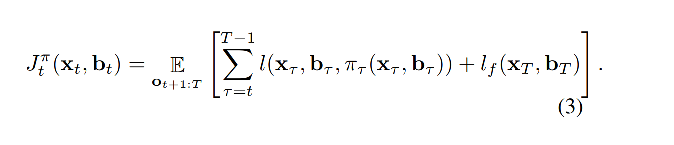
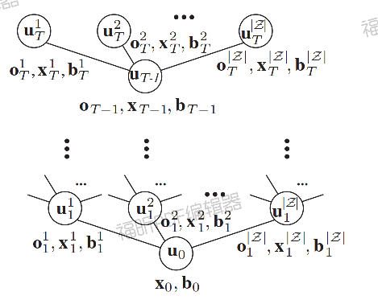

## PODDP
Ref:

https://cs.brown.edu/research/ai/pomdp/tutorial/index.html
https://blog.csdn.net/sinat_52032317/article/details/132790895
https://davidqiu1993.github.io/poddp-paper/

总结：
1. 文中提出了针对场景以及交互不确定性场景下的POMDP的优化方法，通过增加离散潜在状态来“等效不可观测状态”，可以有效的减少不确定性带来的决策抖动等问题；
2. 文中对goal不确定、场景、交互等场景下做了测试，但没有给出如何整合多场景下的解决方案，在现实中如何应用是个问题；
3. 通过离散变量是否可完美处理好交互等问题是个问题？如何比较好的实现“映射”；

### 1.Abstract
1. POMDP在多峰belief情况下、连续状态下、非线性合理性下很难解决；

2. 与先验prior belief空间规划（单峰高斯）不同的是，我们使用离散树结构来，并以此解决多峰高斯问题，和实现连续状态下planning；

### 2.Introduce
1. 传感器不确定性，以及环境不确定性，使用公式化的POMDP是困难的；

2. Extensions of trajectory optimization(?)可以解决状态部分可观的问题，但是仅限制于高斯单峰，POMDP可解决多峰问题，但连续状态是个问题；

3. PODDP（Partially Observable Differential Dynamic Programming），我们在轨迹树上引入**通过观测值定义的belief状态动态传播值函数**和**贝叶斯信念更新**，除此外还包含了一个对DP优化效率的方法；

4. PODDP解决以下问题：

        a. cost依赖不确定潜在状态（如避让目标等）

        b. dynamic依赖环境等不确定性

        c. 交互目标的不确定性

5. PODDP的测试基于两个baseline，a.完全可观的最大似然模型 b.cost中增加了多个状态的加权；

### 3.Related Work
1. Gaussian belief space planning：

        LQG(KF + LQR)：最优观测器+最优控制器，分离原理（Separation Principle），线性系统中，独立设计**最优控制器**和**观测器**，结果依然稳定；

        DDP/ILQG可以解决非线性系统，来保证车辆动力学稳定；

        分离原理分离了观测+控制，导致他们不能来明确对观测的影响来建模；

        文中提出主要有两种Gaussian Belief Space（高斯分布？）的轨迹优化方案，一种使用最大似然来获取确定的状态空间，另一种使用dp传递线性化状态，文中接近第一种方法；

        文中还介绍了基于采样和RL的方法，略过；

2. POMDP求解器：

        主要介绍了MCTS，有指数爆炸的问题，只能生成粗糙轨迹；

3. 相关应用：
    
        提到了预测是否作为belief还是“环境信息”的问题，文中使用了意图作为隐形预测加入belief的策略；

        文中对比了一些其他方案，认为自己的方案更好地处理了交互不确定问题。

### 4.Problem Formulation
1. 假设了一个POMDP模型，连续状态是完全可观察的，只有离散状态是部分可观察的，是一个混合可观测性MDP模型 MOMDP[POMDPs for Robotic Tasks with Mixed Observability]
$S={X,Z}$,其中$X$为连续状态，$Z$为有限状态空间，$u_t$为控制输入

**belief update function**

**cost function**

### 4. Partially Observable differential dynamic programming

1. PODDP和Gaussian belief space空间不同，观测分布不是单峰，PODDP**使用离散潜在变量来控制多模态分布和非高斯置信状态**。并在前向过程中制造N个轨迹树。（POMDP的策略树/MCTS的置信树）；

前向：对于每个潜在状态值按最大似然更新他们的belief；

后向：略过

分层PODDP：因为有维度爆炸的问题，所以文中使用了3层

### 5. Result：见Refs